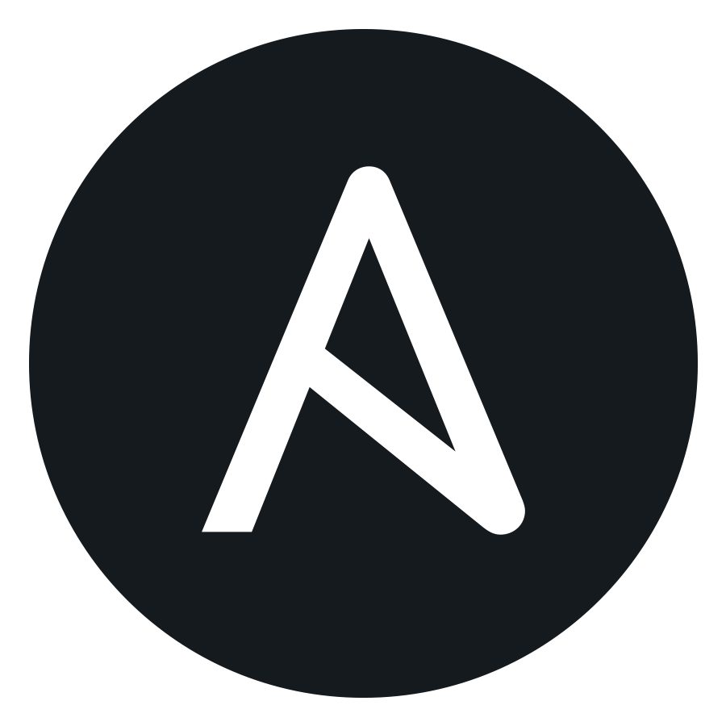
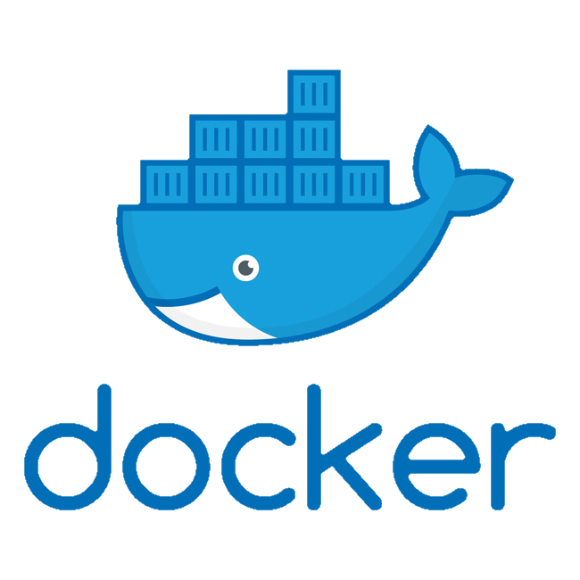

## Hello, I'm Andreas 👋

## What iam doing?

- 🌱 I’m currently learning as always!
- 💬 Ask me about anything!
- 😄 Pronouns: [he/him](https://pronoun.is/he)
- 📫 How to reach me: [e-mail](mailto:andreas.pieniak@outlook.de)

### Preferred Working Environment

[][vscode]
[][ohmyzsh]

 
 
 

### DevOps Tooling

[][ansible]
[][terraform]
[][docker]
[][k8s]

 
 
 

### Languages (Primary)

[][bash]
[][python]

 
 
 

### Languages (Secondary)

[][golang]

 
 
 

### Applications and Services

[][github]
[][gitlab]
[][atlassian]
[][msteams]
[][jenkins]
[][sonarqube]
[][nexus-oss]

 
 
 
 

### Cloud Experience

[][azure]

 
 
 

### Baremetal Hypervisors

[][esxi]

 
 
 

---

<!-- Preferred Tools -->

[vscode]: https://code.visualstudio.com
[ohmyzsh]: https://ohmyz.sh/

<!-- DevOps Tooling -->

[ansible]: https://www.ansible.com/
[terraform]: https://www.terraform.io/
[docker]: https://www.docker.com/
[k8s]: https://kubernetes.io/

<!-- Cloud Providers -->

[azure]: https://azure.microsoft.com/

<!-- Applications and Services -->

[github]: https://github.com/
[gitlab]: https://gitlab.com/
[atlassian]: https://www.atlassian.com/
[msteams]: https://www.microsoft.com/en-us/microsoft-teams/
[jenkins]: https://www.jenkins.io/
[sonarqube]: https://www.sonarqube.org/
[nexus-oss]: https://www.sonatype.com/nexus/repository-oss

<!-- Languages -->

[bash]: http://git.savannah.gnu.org/cgit/bash.git/
[golang]: https://golang.org/
[python]: https://www.python.org/

<!-- Hypervisors -->

[esxi]: https://www.vmware.com/products/esxi-and-esx.html
